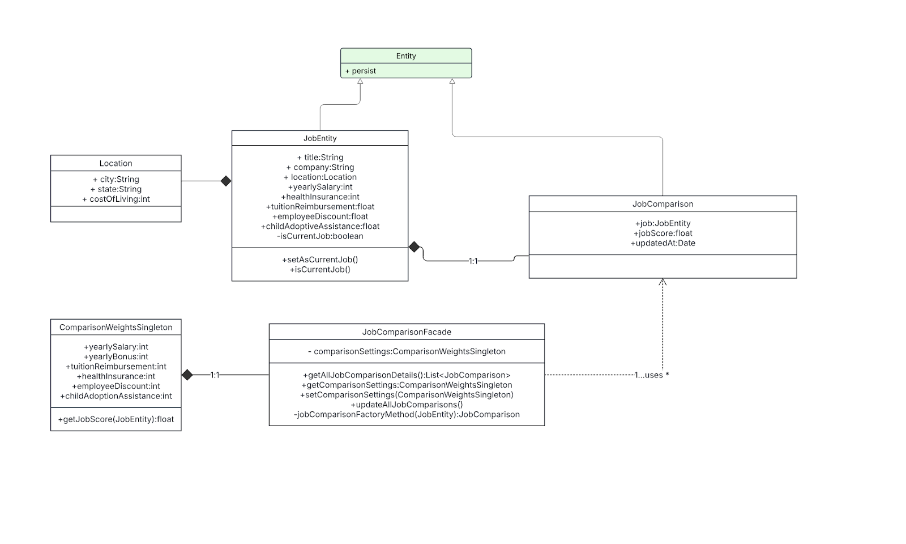
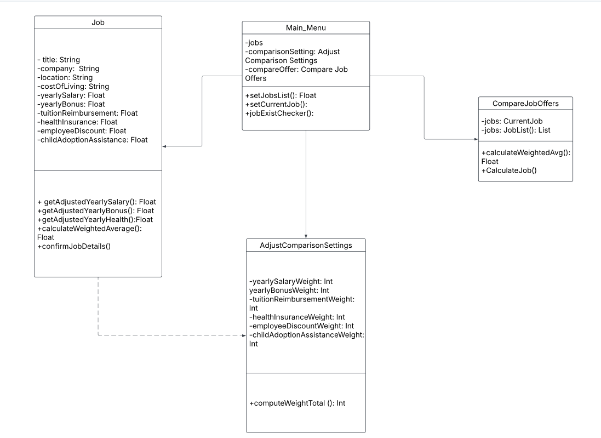
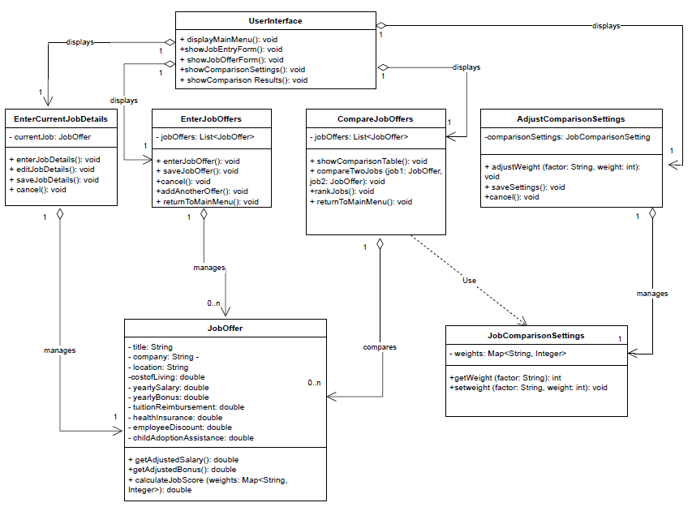
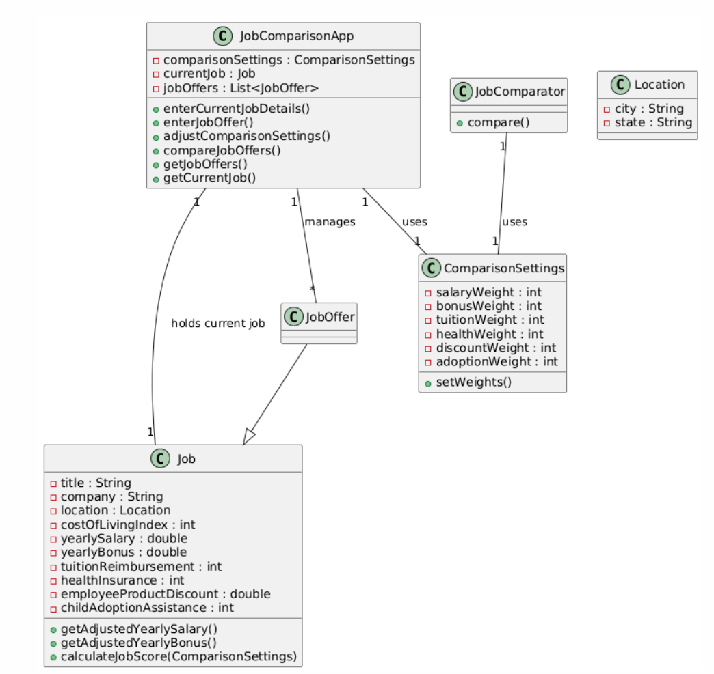
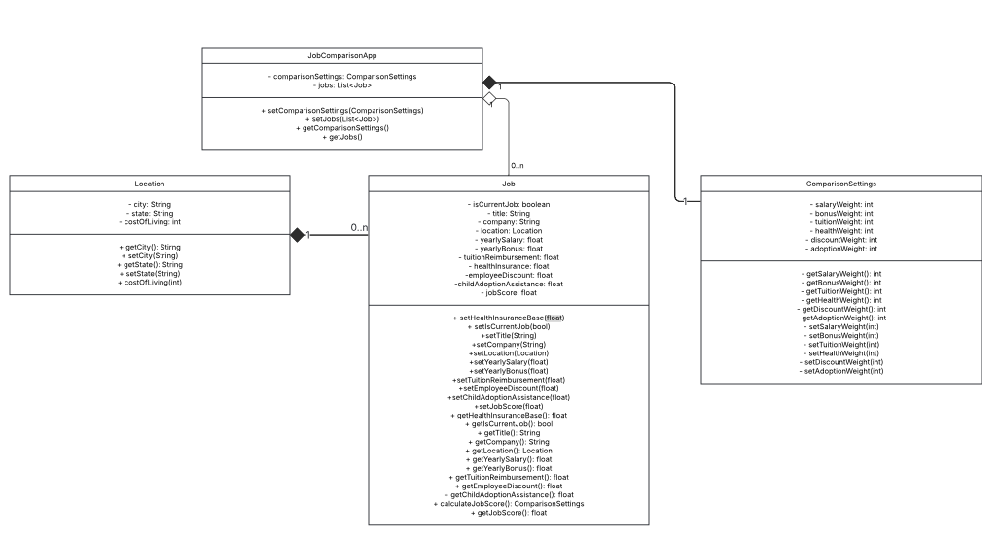
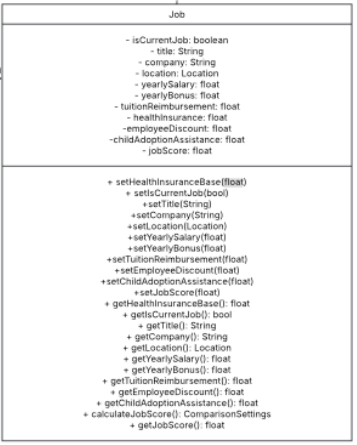
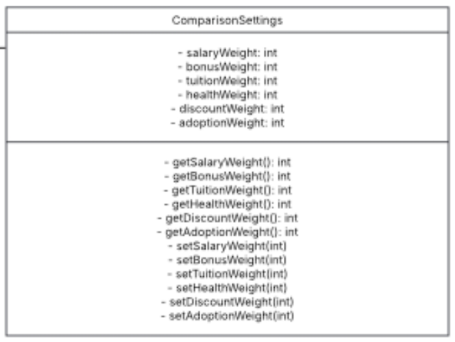
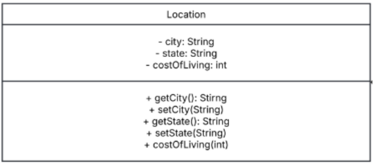
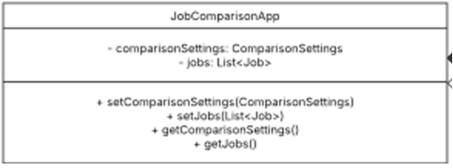

## Design 1
### Author: Kaliel

**Pros:**
* Meets system requirements
* The purposes of all components are easy to understand

**Cons:**
* The design doesn’t consistently use private attributes and public getter/setters, which is standard practice for Java
* The design references design patterns which unnecessarily adds complexity
* The design includes a wrapper for Job, which unnecessarily adds complexity
* The design inconsistently uses UML edges (associations).

## Design 2
### Author: AbdulBaqi

**Pros:**
* Simple design
* Connects all of the classes with one central system 

**Cons:**
* Does not include and type of indicator with regards to composition vs aggregation
* Does not separate location so can create additional work required if location information ends up needing to be changed
* Does not include all of the required getter and setters 
* Is missing some of the required methods 

## Design 3
### Author: Jingwen

**Pros:**
* Clear User Interaction – Defines UI flow well with separate classes for job entry, comparison, and settings.
* Structured Job Comparison – Separates job entry, saving, and ranking clearly.
* Encapsulated Settings – JobComparisonSettings allows easy weight customization.

**Cons:**
* Too Many UI Classes – Overcomplicates system logic; UI should be separate from core functionality.
* No Location Class – Stores location as a string instead of a reusable class.
* Redundant Job Management – Multiple classes handle job offers instead of a centralized approach.
* No isCurrentJob variables – Lacks a clear way to identify the user’s current job.
* Less Structured Methods – Comparison methods could explicitly use ComparisonSettings.

## Design 4
### Author: Michael

**Pros:**
* The diagram is focused on simplicity and using fewer classes where possible. The number of fields and classes are very minimalized.
* Functionality such as comparisons or navigation is off-loaded to the GUI and code implementation.
* This results in a faster setup time for a MVP since it increases quick legibility.

**Cons:**
* Location utility class not being connected to Job in any clear relationship. This is an oversight.
* There is greater ambiguity in deciding how the system works. It is required to alter the diagram largely for future changes.
* Many team members did not see that the 1-to-1 relationship between Job and JobComparisonApp represented currentJob.
* JobOffer being a sub-class of Job also raised questions, but it mostly came out as a minimum requirement to differentiate from currentJob.

## Team Design

### The `Job` Class
#### Author: Kaliel

The Job class is common across all individual team member implementations. 2/4 team members used a separate class for Location. ¾ team members used public getters and setters for each of the class methods, with private attributes. ¼ team members believed that jobScore should exist outside of Job, and be part of a wrapper class to Job, but others thought this was unnecessarily complex. As it exists, the class is a good balance of simplicity and effectiveness for the system requirements.

### The `ComparisonSettings` Class
#### Author: AbdulBaqi

Several of our team members had a separate class where they would adjust the job comparison settings where the user would be assigning the various different integer weights that are used in computing the weighted average for the job score. We decided that this approach was an ideal one and decided to thus implement it as a separate class. We decided on calculating the job score outside of the class in the job class as it would be simpler and more effective.

### The `Location` Class
#### Author: Michael

Team members originally had Location as a separate entity or utility class. We want the location to be responsible for the costOfLiving, city, and state fields. Kaliel explained that this is so updating costOfLiving can be done in one place for all locations to reference.
Each Job must have at least one Location.

### The `JobComparisonApp` Class
#### Author: Jingwen

Several team members originally included UI-related methods within JobComparisonApp. The group removed these methods to separate concerns, ensuring that the class focuses only on managing job offers and comparison settings. Some team members also integrated ranking logic or a JobComparisonFacade, but the group simplified ComparisonSettings with clear getter and setter methods. This allows job comparisons to remain flexible without adding unnecessary complexity. By maintaining only essential methods like setJobs and getJobs, the group’s design ensures scalability and easier modifications in the future.

## Summary
Aside from a couple of misunderstandings over the proper structure of a Java class, UML diagramming, and interpretation 
over the requirements, each individual on this team largely designed very similar systems. The only points of debate had
to do with what reasonable optimizations for coupling and cohesion at this stage of design. We decided to err on the 
side of simplicity.