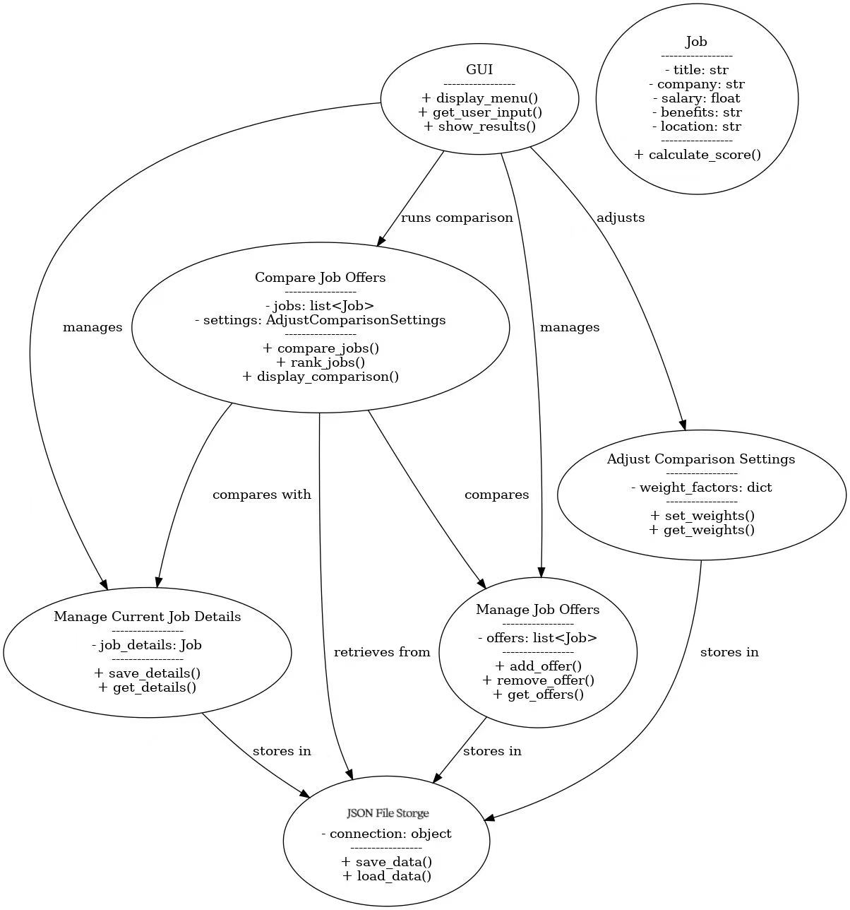
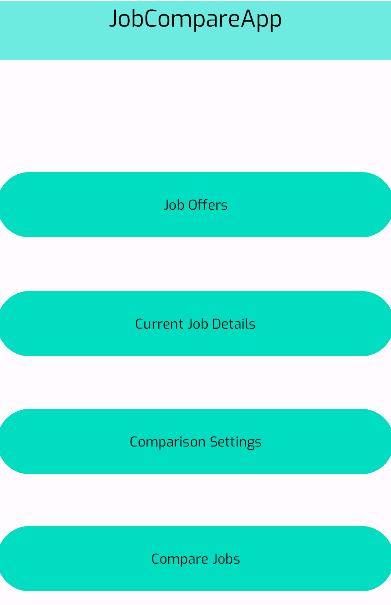
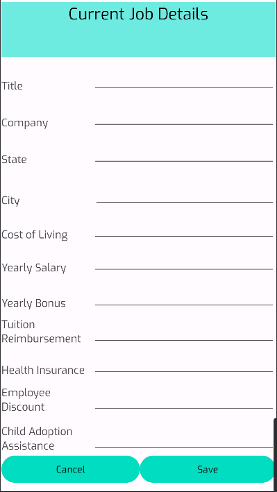
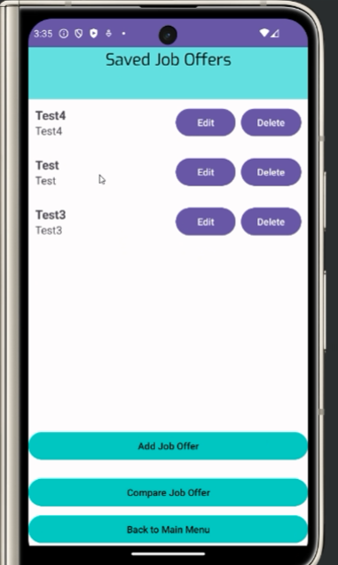
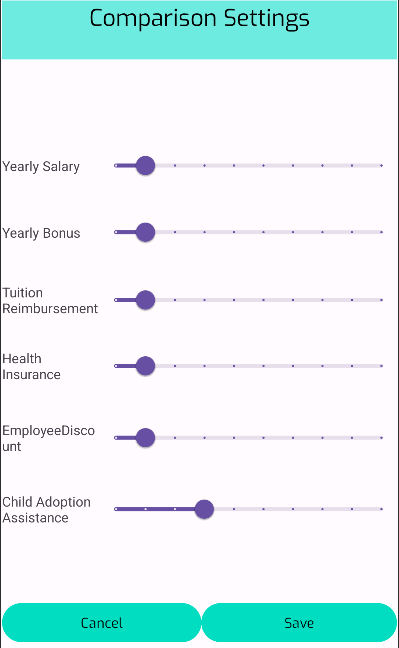
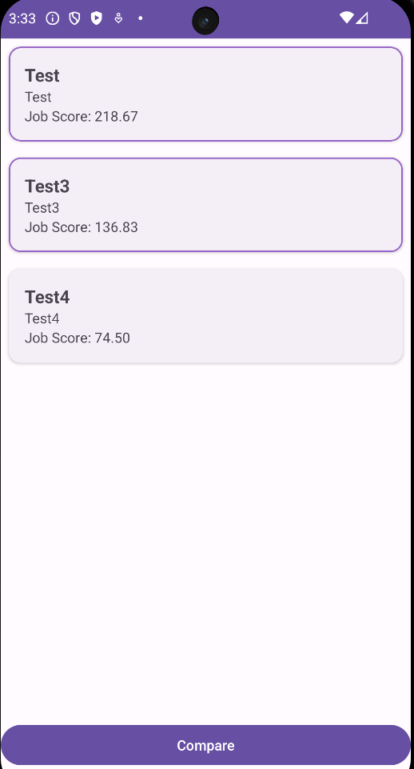
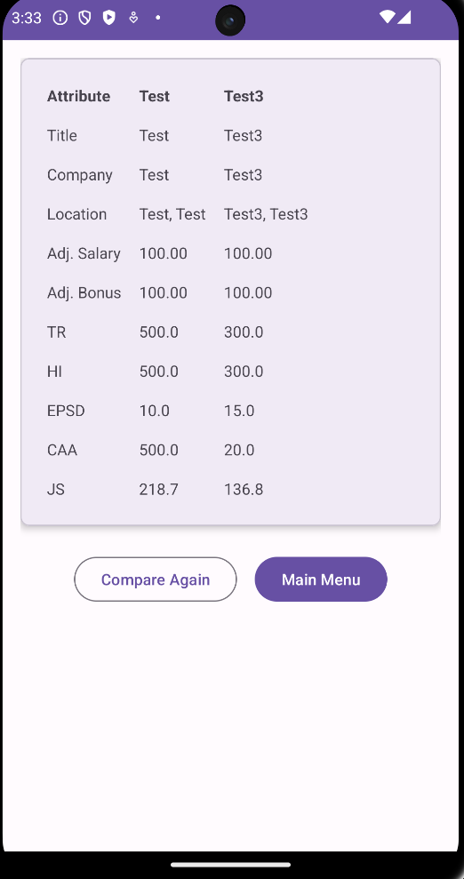

# Design Document

**Author**: <team065>

## 1. Design Considerations

### 1.1 Assumptions

The main assumption is that we will all be using Android Studio to implement this application. We will also use GitHub as our version control system, working together as a team to make various changes and edits to our Android application. The API level we will be using is 33 (Android 13). JSON File Storage will be used to save our data.

### 1.2 Constraints

This application will run on the Android operating system and will only be compatible with Android 13 and above. Java will be our primary language for coding this application.

### 1.3 System Environment

The system needs to run on Android 13 with API level 33. The application will be used on an Android mobile device.

## 2. Architectural Design

### 2.1 Component Diagram

The components that are part of the application are as follows:

- **GUI**: The user interface that allows access to different components of the application, including **Manage Current Job Details, Manage Job Offers, Adjust Comparison Settings, and Compare Job Offers**.
- **Manage Current Job Details**: Users can enter and save information about their current job for later comparison with other job offers.
- **Manage Job Offers**: Users can input multiple job offers via the GUI to be used later in the comparison process.
- **Adjust Comparison Settings**: Allows users to modify job weighting factors that will influence the calculation of job scores.
- **Compare Job Offers**: Runs various calculations based on previously entered job data. Displays a ranked list of jobs based on job scores and allows users to compare two selected jobs.
- **JSON File Storage**: Stores various information used across all components, ensuring data persistence even after closing the app.

### 2.2 Deployment Diagram

A deployment diagram is unnecessary because this is a simple system that runs on a single device. The entire application, including the GUI, job management components, comparison logic, and JSON File Storage, will be deployed on a personal computer or mobile device. Since there are no distributed components, cloud-based services, or multiple interacting servers, all components are packaged and executed within a single local environment.

## 3. Low-Level Design

### 3.1 Class Diagram

The UML Class Diagram represents the static structure of the system, detailing the components and their relationships:

#### **GUI**
- The main interface for user interactions.
- Provides access to **Manage Current Job Details, Manage Job Offers, Adjust Comparison Settings, and Compare Job Offers**.

#### **Manage Current Job Details**
- Allows users to enter and save details about their current job.
- Stores job information for later comparison.

#### **Manage Job Offers**
- Enables users to input multiple job offers.
- Stores job details for comparison.

#### **Adjust Comparison Settings**
- Lets users modify job weighting factors that influence the calculation of job scores.
- Helps customize the job comparison process.

#### **Compare Job Offers**
- Runs calculations based on **job offers and current job details**.
- Displays jobs in a ranked list based on job scores.
- Allows users to compare two different jobs from the list.

#### **JSON File Storage**
- Stores and retrieves job-related data.
- Ensures that all **Manage Current Job Details, Manage Job Offers, and Adjust Comparison Settings** components can persist their data even after closing the application.

## 4. User Interface Design

