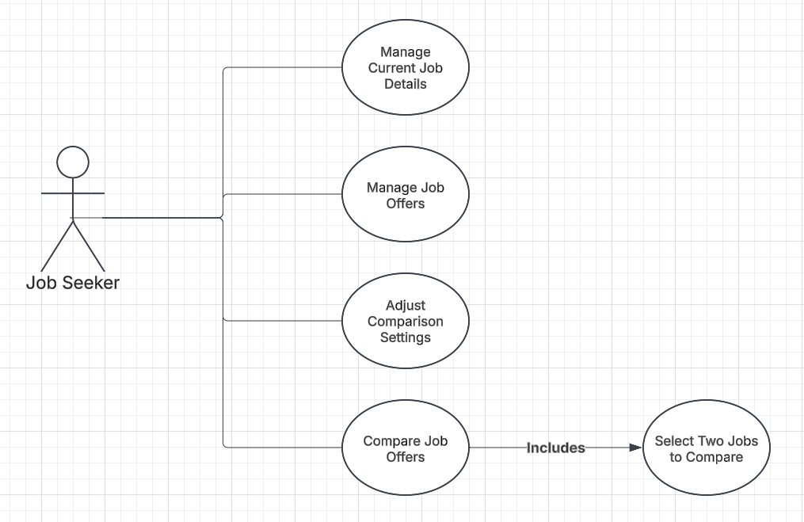

# Use Case Model

*This is the template for your use case model. The parts in italics are concise explanations of what should go in the corresponding sections and should not appear in the final document.*

**Author**: Team065

## 1 Use Case Diagram

*This section should contain a use case diagram with all the actors and use cases for the system, suitably connected.*

## 2 Use Case Descriptions

*For each use case in the use case diagram, this section should contain a description, with the following elements:*

- *Requirements: High-level description of what the use case must allow the user to do.*
- *Pre-conditions: Conditions that must be true before the use case is run.*
- *Post-conditions Conditions that must be true once the use case is run.*
- *Scenarios: Sequence of events that characterize the use case. This part may include multiple scenarios, for normal, alternate, and exceptional event sequences. These scenarios may be expressed as a list of steps in natural language or as sequence diagrams.*

### 2.1 Manage Current Job Details

- **Requirements:** Allows the user to enter or edit their current job details.
- **Pre-conditions:** The application is running, and the user has selected the "Enter/Edit Current Job Details" option from the main menu.
- **Post-conditions:** The current job details are either saved or discarded, and the user is returned to the main menu.
- **Scenarios:**
    - **Normal Scenario:**
        1.  The user is presented with a form to enter or edit job details.
        2.  The user fills in the form fields.
        3.  The user clicks "Save."
        4.  The system validates the input and saves the job details.
        5.  The user is returned to the main menu.
    - **Alternate Scenario (Cancel):**
        1.  The user is presented with a form to enter or edit job details.
        2.  The user clicks "Cancel."
        3.  The system discards any changes.
        4.  The user is returned to the main menu.

### 2.2 Manage Job Offers

- **Requirements:** Allows the user to enter and manage job offers.
- **Pre-conditions:** The application is running, and the user has selected the "Enter Job Offers" option from the main menu.
- **Post-conditions:** The job offer details are either saved or discarded, and the user is presented with options to add another offer or return to the main menu.
- **Scenarios:**
    - **Normal Scenario (Save):**
        1.  The user is presented with a form to enter job offer details.
        2.  The user fills in the form fields.
        3.  The user clicks "Save."
        4.  The system validates the input and saves the job offer details.
        5.  The user is presented with options to add another offer or return to the main menu.
    - **Alternate Scenario (Cancel):**
        1.  The user is presented with a form to enter job offer details.
        2.  The user clicks "Cancel."
        3.  The system discards any changes.
        4.  The user is presented with options to add another offer or return to the main menu.

### 2.3 Adjust Comparison Settings

- **Requirements:** Allows the user to adjust the weights for comparison criteria.
- **Pre-conditions:** The application is running, and the user has selected the "Adjust Comparison Settings" option from the main menu.
- **Post-conditions:** The comparison settings are updated, and the user is returned to the main menu.
- **Scenarios:**
    - **Normal Scenario:**
        1.  The user is presented with a form to adjust comparison weights.
        2.  The user enters the new weights.
        3.  The user clicks "Save."
        4.  The system validates and saves the new settings.
        5.  The user is returned to the main menu.
    - **Alternate Scenario (Cancel):**
        1.  The user is presented with a form to adjust comparison weights.
        2.  The user enters the new weights.
        3.  The user clicks "Cancel."
        4.  The system discards any changes.
        5.  The user is returned to the main menu.

### 2.4 Compare Job Offers

- **Requirements:** Allows the user to compare two selected jobs (including the current job).
- **Pre-conditions:** The application is running, job offers have been entered, and the user has selected the "Compare Job Offers" option from the main menu.
- **Post-conditions:** The comparison results are displayed, and the user is offered to perform another comparison or return to the main menu.
- **Scenarios:**
    - **Normal Scenario:**
        1.  The system retrieves and displays a ranked list of jobs.
        2.  **Select Jobs to Compare (Included):** The user selects two jobs from the list.
        3.  The system displays a comparison table with job details and scores.
        4.  The user is offered to perform another comparison or return to the main menu.

[def]: UseCaseModel.png